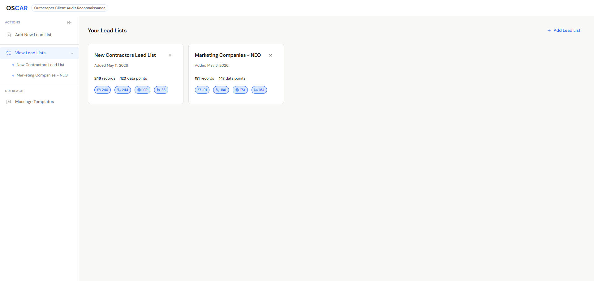
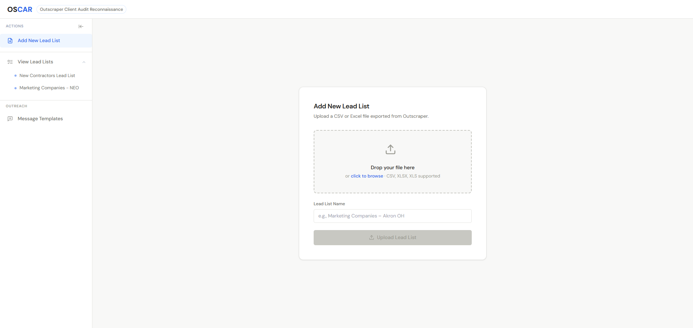
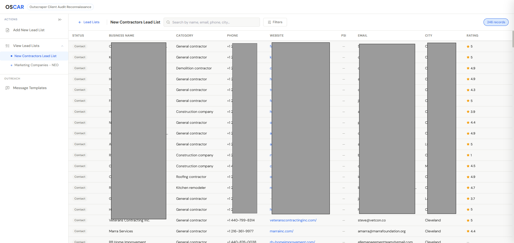
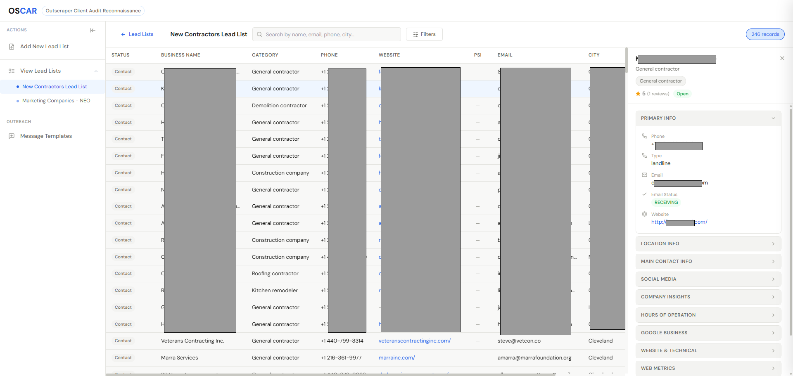
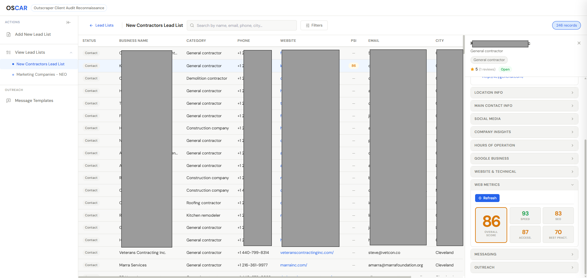
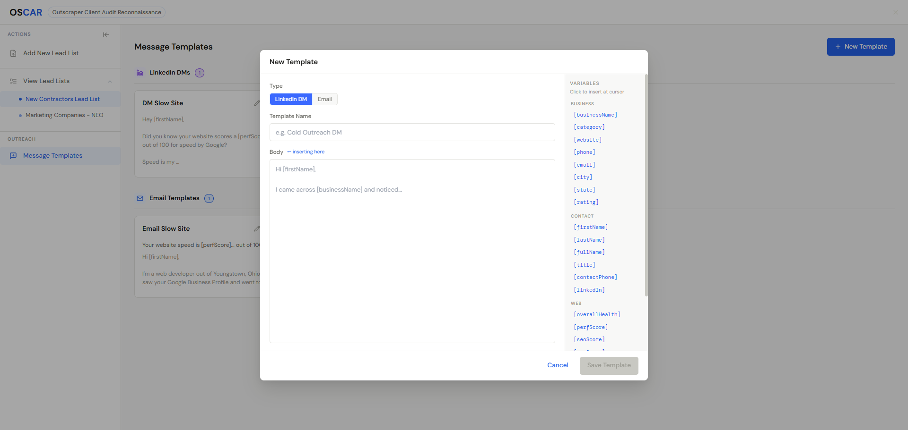
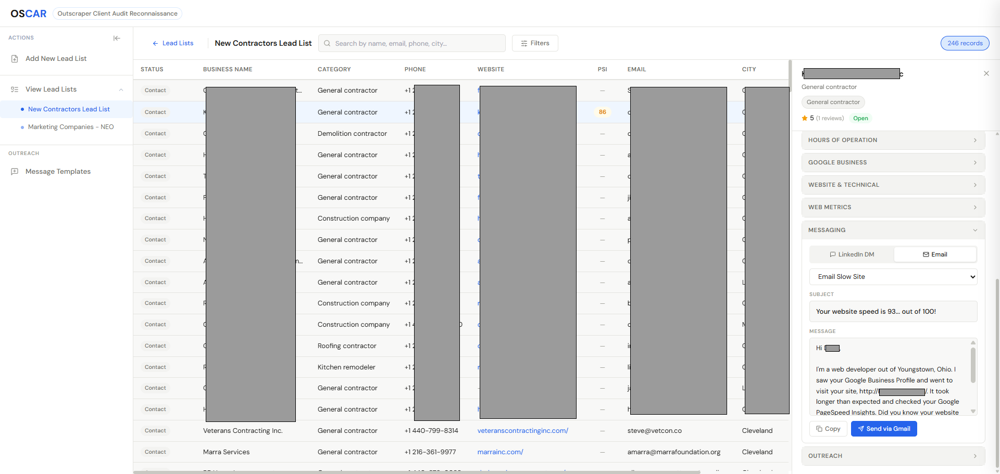

# OSCAR — Outscraper Client Audit Reconnaissance

A SaaS-style lead management dashboard for organizing, exploring, and acting on business lead datasets exported from Outscraper and similar Google scraper tools. All data persists locally in your browser — no backend, no account required.

---

## Screenshots

### Lead Lists Gallery

The main dashboard shows all uploaded lead lists as cards. Each card displays the list name, date added, total record count, data point count, and at-a-glance badges for emails, phone numbers, websites, and LinkedIn entries found in the list.

---

### Add New Lead List

The upload screen accepts CSV, XLSX, or XLS files via drag-and-drop or file picker. After selecting a file, name the lead list and click **Upload Lead List** to parse and save it to IndexedDB. Existing lists are always accessible in the left sidebar.

---

### Lead List Explorer

The data explorer opens when you select a list. A virtualized table (handles 5,000+ rows without lag) shows **Status**, **Business Name**, **Category**, **Phone**, **Website**, **PSI score**, **Email**, **City**, and **Rating**. A live search bar and **Filters** button let you narrow results instantly. The record count is always visible in the top-right corner.

---

### Lead Detail Panel

Clicking any row opens a right-side detail drawer with collapsible sections: **Primary Info** (phone, email, website), **Location Info**, **Innate Contact Info**, **Social Media**, **Company Insights**, **Hours of Operation**, **Google Business**, **Website & Technical**, **Web Metrics**, **Messaging**, and **Outreach**. The panel also shows a star rating badge and outreach status at the top.

---

### Web Metrics Overview

The **Web Metrics** section in the detail panel runs a Google PageSpeed Insights audit against the lead's website. Results show an overall health score (color-coded: red < 50, yellow 50–89, green 90+) alongside individual Lighthouse scores for **Performance**, **SEO**, **Accessibility**, and **Best Practices**. Audits run in the background and results persist with the record.

---

### Message Template Engine

The **Message Templates** view lets you create LinkedIn DM and Email templates. The template editor modal shows a type selector (LinkedIn DM / Email), a template name field, a body composer, and a full **Variables** palette on the right — click any variable tag (`[businessName]`, `[perfScore]`, `[firstName]`, etc.) to insert it at the cursor. Saved templates appear on the left organized by type.

---

### Rendered Message (in Detail Panel)

Inside the **Messaging** section of the detail panel, select a template from the dropdown and OSCAR auto-fills all variables with the lead's real data. The rendered message is ready to copy to clipboard or, for email templates, send directly via Gmail with a pre-filled subject and body.

---

## Features

- **Multi-list management** — upload and switch between any number of lead datasets
- **Virtualized table** — smooth scrolling through 5,000+ row exports
- **Live search** — instant filtering across name, email, phone, city, and website
- **Advanced filters** — status, presence (has website / LinkedIn / email), star rating, review count, CMS platform, PSI threshold, days since last contact
- **Outreach tracking** — cycle status (New → Contacted → Follow-up), log contact method (Email, DM, Cold Call), record last-contact timestamp
- **Message templates** — LinkedIn DM and Email templates with `[variable]` substitution; Gmail compose integration
- **Web metrics** — Google PageSpeed Insights audit (Performance, SEO, Accessibility, Best Practices) stored per-record
- **Column aliasing** — handles naming variation across different scraper export formats automatically
- **100% local** — all data stored in IndexedDB via Dexie; works offline after first load

---

## Quick Start

```bash
npm install
npm run dev
```

Open [http://localhost:5173](http://localhost:5173).

### PageSpeed Insights (optional)

To enable the Web Metrics audit feature, create a `.env.local` file in the project root:

```
VITE_PSI_KEY=your_google_pagespeed_api_key
```

Get a free key at [Google PageSpeed Insights API](https://developers.google.com/speed/docs/insights/v5/get-started). Without a key, the Web Metrics section will not run audits.

---

## Tech Stack

| Library | Purpose |
|---------|---------|
| React 18 + Vite | UI framework and build tool |
| Dexie.js | IndexedDB wrapper — persists datasets and templates |
| PapaParse | CSV parsing |
| SheetJS (xlsx) | Excel (XLSX / XLS) parsing |
| React Window | Virtualized table rendering for large datasets |
| Lucide React | Icons |
| Tailwind CSS | Utility classes (CSS variables handle most theming) |

---

## Project Structure

```
src/
├── App.jsx                    # Root component — view routing and top-level state
├── main.jsx                   # React entry point
├── index.css                  # CSS custom properties and global styles
├── db.js                      # Dexie schema (datasets + templates stores)
│
├── components/
│   ├── Sidebar.jsx            # Left nav — collapsible, lists all datasets
│   ├── FileUpload.jsx         # Drag-and-drop upload view
│   ├── GalleryView.jsx        # Lead list card grid (dashboard)
│   ├── DatasetCard.jsx        # Individual dataset card
│   ├── DataExplorer.jsx       # Search toolbar + table + detail panel container
│   ├── DataTable.jsx          # Virtualized table (react-window)
│   ├── DetailPanel.jsx        # Right-side row detail drawer
│   ├── FilterDrawer.jsx       # Advanced filter interface
│   ├── OutreachControls.jsx   # Status cycling + contact logging
│   ├── MessagingPanel.jsx     # Template selector + rendered output + Gmail link
│   ├── TemplatesView.jsx      # Template management page
│   ├── TemplateEditor.jsx     # Create/edit template modal
│   ├── WebMetrics.jsx         # PageSpeed audit UI + score display
│   ├── AuditIndicator.jsx     # In-flight audit status badge
│   └── ToastContainer.jsx     # Toast notification renderer
│
├── contexts/
│   └── AuditContext.jsx       # Global audit state — prevents duplicate PSI calls
│
├── hooks/
│   ├── useDatasets.js         # IndexedDB CRUD for datasets (load, save, delete, updateRow)
│   ├── useTemplates.js        # IndexedDB CRUD for templates
│   └── useToast.js            # Toast state management
│
└── utils/
    ├── columns.js             # COL_MAP alias table + getCol / fmt / g helpers
    ├── parseFile.js           # CSV (PapaParse) and XLSX (SheetJS) parsing
    ├── shortcodes.js          # Template variable resolution ([businessName] → row value)
    └── pagespeed.js           # Google Lighthouse API integration
```

---

## Data Model

### Dataset

```js
{
  id: string,           // unique ID
  name: string,         // user-given list name
  createdAt: number,    // Unix timestamp
  rowCount: number,
  columns: string[],    // column names from source file
  rows: object[]        // full row data
}
```

### Row fields (sourced from scraper export, varies)

| Group | Fields |
|-------|--------|
| Business | `name`, `category`, `phone`, `website`, `email`, `address`, `city`, `state`, `rating`, `reviews`, `business_status`, `working_hours` |
| Contact person | `first_name`, `last_name`, `title`, `contact_phone`, `contact_linkedin` |
| Company insights | `employees`, `industry`, `founded`, `revenue` |
| Website / Tech | `site_title`, `site_description`, `generator` (CMS), `has_gtm`, `has_fb_pixel`, `domain` |
| Social | `company_linkedin`, `company_facebook`, `company_instagram`, `company_x`, `company_youtube` |
| Outreach (internal) | `_status`, `_contactMethod`, `_lastContacted` |
| Web metrics (audit) | `perfScore`, `seoScore`, `accScore`, `bpScore`, `overallHealth` |

### Template

```js
{
  id: string,
  name: string,
  type: 'Email' | 'DM',
  subject: string,      // email templates only
  body: string,         // supports [variable] shortcodes
  createdAt: number
}
```

### Template variables

`[businessName]` `[category]` `[website]` `[phone]` `[email]` `[city]` `[state]` `[rating]` `[firstName]` `[lastName]` `[fullName]` `[title]` `[contactPhone]` `[linkedin]` `[overallHealth]` `[perfScore]` `[seoScore]` `[status]`

---

## Common Customizations

**Add or reorder table columns** — edit `TABLE_COLUMNS` in [src/components/DataTable.jsx](src/components/DataTable.jsx).

**Support a new column name from your scraper** — add an alias to `COL_MAP` in [src/utils/columns.js](src/utils/columns.js).

**Add a new detail panel section** — edit [src/components/DetailPanel.jsx](src/components/DetailPanel.jsx); each `<Section>` block is self-contained.

**Add a template variable** — add the key/resolver pair to [src/utils/shortcodes.js](src/utils/shortcodes.js).

**Change the accent color** — edit `--accent` and related variables at the top of [src/index.css](src/index.css).

---

## Build for Production

```bash
npm run build
```

Output goes to `dist/`. Open `dist/index.html` directly in a browser or serve it from any static host. No server-side dependencies.
